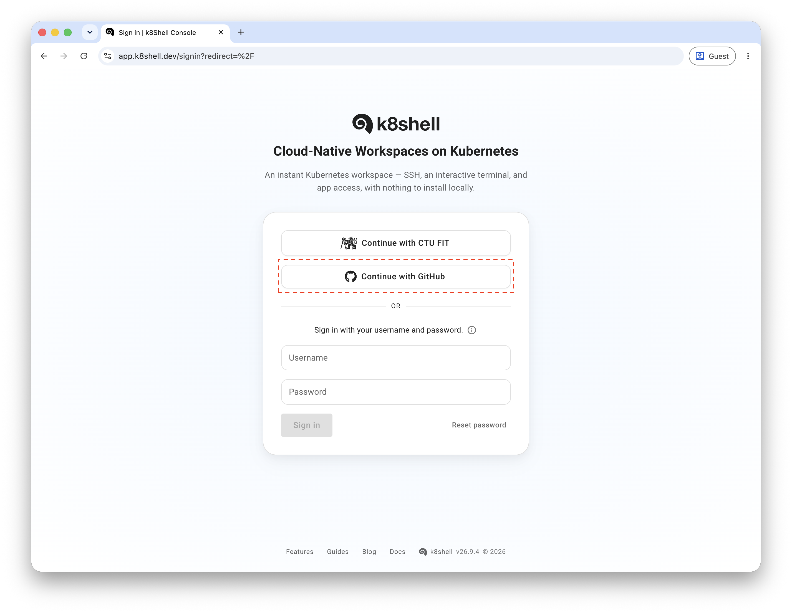

## Prerequisites

k8shell allows you to sign in using your existing GitHub account.

* **Course access** - you get access to workspace blueprints according to the courses you are subscribed to. Your account is automatically enabled once you attend a course that uses k8shell in its labs.
* **SSH key** - k8shell authenticates SSH and VS Code connections using SSH keys. Make sure you have an SSH key uploaded to GitHub *before* your first sign-in, so it can be automatically transferred to your k8shell account. If you have not done this yet, follow the [GitHub instructions](https://docs.github.com/en/authentication/connecting-to-github-with-ssh) to generate and upload your SSH key.

## Sign-in

To access your workspace, open the k8shell sign-in page at https://app.k8shell.dev. You will see the following screen:



Sign in using the **Continue with GitHub** button, which authenticates you via your GitHub account. The username/password form is currently not available and should not be used.

After signing in, you will be redirected to the GitHub login page (if you are not already logged in) and then back to k8shell. The first time you sign in, GitHub will ask you to approve the k8shell application's access to your GitHub resources - you need to authorize this for the sign-in to complete.

## Create a workspace

You get access to workspace blueprints according to the courses you are subscribed to. For example, if you are subscribed to a course with a workspace blueprint called `arc`, you will have access to it.

To provision a workspace from a blueprint:

1. Go to **Workspaces**.
2. Press the **Create workspace** button.
3. Select **From blueprint**.
4. Choose your course's blueprint (e.g. `arc`).
5. Press **Create**.

The workspace will be created within a few seconds, and its progress will be shown in the table.

Once the workspace status is **Running**, open the workspace dashboard. From there you can:

* Use the **Terminal** tab to access the workspace directly in your browser, or
* Copy the SSH or VS Code connection commands to connect to the workspace from your own computer, as described in the [Connecting to your workspace](#connecting-to-your-workspace) section below.

To connect to a workspace from your computer, you need a public key registered in k8shell. If you signed in via GitHub and already had an SSH key uploaded there, that key is automatically transferred to k8shell for you to use, so you can connect right away provided you have the corresponding private key on your computer (in your `.ssh` directory).

## Connecting to your workspace

Once your workspace is **Running**, you can connect to it using any SSH client, Visual Studio Code (with the Remote - SSH extension), or any SFTP client to copy files to and from your workspace, in addition to the browser-based Terminal tab in the workspace dashboard.

When connecting, you identify the workspace using `<username>~<workspace>` as the SSH username, where `<username>` is your username and `<workspace>` is the name of the workspace you created from a blueprint (by default the same as the blueprint name, e.g. `arc`).

When you are logged in to the workspace, you operate under your own username with your own UID and GID numbers. By default, you do not have privileged access in the workspace, however, depending on your course settings, you may have `sudo` privileges too. Using `sudo` you can install additional software, manage packages, and perform administrative tasks inside your workspace.

### SSH access

The SSH command to access your workspace is as follows:

```bash
ssh -i </path/to/key> <username>~<workspace>@app.k8shell.dev
```

where `</path/to/key>` is the path to your SSH private key stored on your computer (usually `~/.ssh/id_rsa`), `<username>` is your username, and `<workspace>` is the name of the workspace you want to access.

For example, to access the workspace `arc` with the username `john`, and the private key `~/.ssh/id_rsa`:

```bash
ssh -i ~/.ssh/id_rsa john~arc@app.k8shell.dev
k8shell v26.9.4
Last login: Mon Sep 16 14:43:30 2024 from 10.126.2.67

john@arc:~$
```

After you run the command, you will be logged in to the workspace. The prompt will show you the username and workspace you are currently using. You can now start using the workspace by running commands in the terminal. Note that you can use almost any ssh option with the ssh command, such as `-L` or `-D` for port forwarding, `-A` for agent forwarding etc.

### SSH configuration

You can also configure your SSH client to access your workspace without specifying the key and username each time. Add the following configuration to your `~/.ssh/config` file:

```bash
Host k8shell
    HostName app.k8shell.dev
    PreferredAuthentications publickey
    User <username>~<workspace>
    Port 22
    IdentityFile /path/to/key
    ForwardAgent yes # if you want to forward your SSH agent
```

After adding the configuration, you can access the workspace using the following command:

```bash
ssh k8shell
```

You can also use this configuration to access another workspace by overriding the workspace name in the command:

```bash
ssh john~arc@k8shell
```

### SSH Port Forwarding

You can also use SSH port forwarding to access services running on the workspace from your local machine. For example, if you have a Web server running on the workspace listening on port `tcp/80`, you can forward the port to your local machine using the following command:

```bash
ssh -L 8080::80 john~arc@k8shell
```

After running the command, you can access the Web server running on the workspace by opening `http://localhost:8080` in your browser.

### SSH Agent Forwarding

If you need to access other services that require SSH authentication, you can use SSH agent forwarding. To enable SSH agent forwarding, you need to add the `-A` option to the SSH command:

```bash
ssh -A john~arc@k8shell
```

Note that this option can also be enabled in the SSH configuration by using `ForwardAgent yes` as described in the previous section. SSH agent forwarding allows you to use your local SSH keys to authenticate to other services from the workspace. The remote workspace does not store your SSH keys, but it forwards the authentication requests to your local machine.

### VSCode

You can also access the workspace using Visual Studio Code (VSCode). To do this, you can follow the [official documentation](https://code.visualstudio.com/docs/remote/ssh) on how to connect to a remote SSH server.

Below are simple steps to connect to your workspace:

1. Install the [Remote - SSH extension](https://marketplace.visualstudio.com/items?itemName=ms-vscode-remote.remote-ssh) in VSCode.
2. Open the Command Palette (`Ctrl+Shift+P`) and run the `Remote-SSH: Connect to Host...` command.
3. Select `k8shell` from the list of hosts (assuming you have the SSH configuration from the previous section).
4. You will be connected to the workspace.

Note that if you do not specify `User` in the SSH configuration, you will need to provide the username and workspace name in the `User` field in the VSCode connection dialog.

If you have the VSCode `code` CLI installed on your computer, you can also open VSCode directly from the terminal by running the following command:

```bash
code -n --folder-uri=vscode-remote://ssh-remote+john~arc@k8shell/home/john/workspace
```

When you connect to the workspace using VSCode, it will first install the VSCode server on the workspace, and then it will connect to the server using the SSH protocol's port forwarding. You use VSCode like you would use it on your local machine. When you develop an application in VSCode and run it in debug mode, the application will run on the workspace, but you can debug it from your local machine. VSCode will automatically forward the port your application is listening on to your local machine so you can access it from your browser.

## Git access

For development of your projects, you can use Git to manage your source code. Access to Git repositories is over HTTPS, using a token provisioned for you automatically.

Once you have onboarded via GitHub, your workspace is preconfigured with a Git credential helper that authenticates against GitHub using this provisioned token, so you can clone, push, and pull repositories without entering any credentials:

```bash
git clone https://github.com/<repo>.git
```

The token itself is not stored in your workspace - it is kept in the k8shell backend, and the credential helper retrieves it on demand whenever Git needs to authenticate.

### Managing your Git access

You can manage the provisioned token from the console by opening **Credentials** in the user menu in the sidebar. From there you can:

* Delete the token
* Disable access to it
* Add a new token, if required

## Workspace Usage

The workspace will be available for you to use until the end of the semester. Every workspace has two persistent volumes attached to it: your home directory mounted at `/home/<username>` and a shared directory mounted at `/opt/shared`. There is a symbolic link created in your home directory to the shared folder. You have read/write access to your home directory where you can store all files. The size of your home directory volume is set to 10GB by default and can be dynamically adjusted should you have a requirement to store more data. Please contact your lab tutor to ask for more space. Note that your home directory is also used to store various configuration files of software you use as well as is the place where vscode and intellij remote servers store their binaries. The shared folder is used by your tutor to distribute files to students and students do not have write permissions in it.      

The workspace is ephemeral which means that when the workspace is stopped or terminated, any data stored in the workspace outside of the persistent volumes will be lost (such as when you install a new package or software) - see [Workspace Management](#workspace-management) below for the difference between the two. Although the workspace should not be stopped during the semester, it is recommended to create an installation script in case you are installing any software so that you can repeat the installation process if the workspace is recreated.

### CPU and Memory

Each workspace has a limited amount of CPU and memory available. This limit is defined by your course and it should be sufficient to complete your course tasks. If you think that you need more resources, please contact your lab tutor.

## Workspace Management

Once created from a blueprint, the workspace will be running for the whole semester, and you can access it anytime you need using the workspace dashboard, SSH, or VSCode as described above.

You can stop or terminate your workspace either from the console or from the terminal:

* To **stop** the workspace, run `shutdown` in the terminal, or press the corresponding button in the workspace dashboard. Your home directory is preserved and will be re-attached the next time you start the workspace. Any software or changes made outside your home directory, however, will be lost.
* To **terminate** the workspace, run `shutdown --delete` in the terminal, or press the corresponding button in the workspace dashboard. This also deletes your home directory, so make sure to push or back up any work you want to keep before terminating.

When you access a stopped workspace again (via the dashboard, SSH, or VSCode), it will be automatically started for you.
